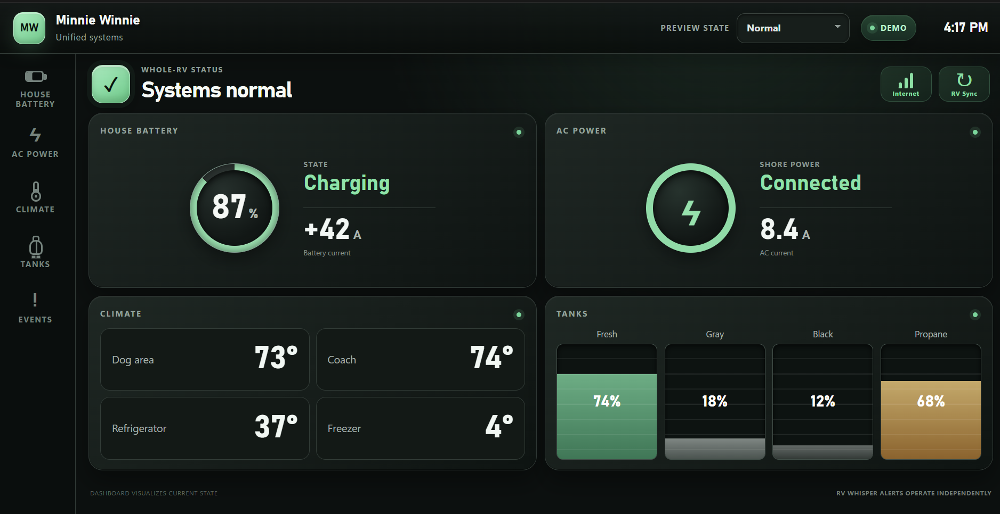
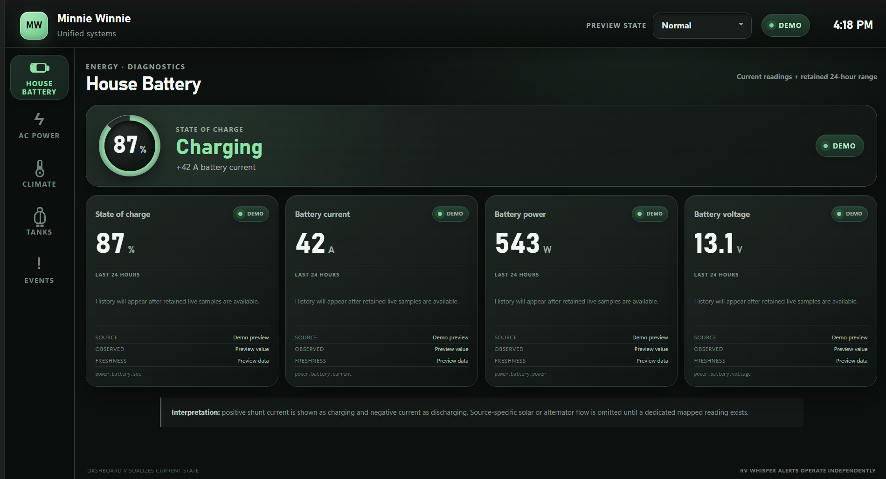
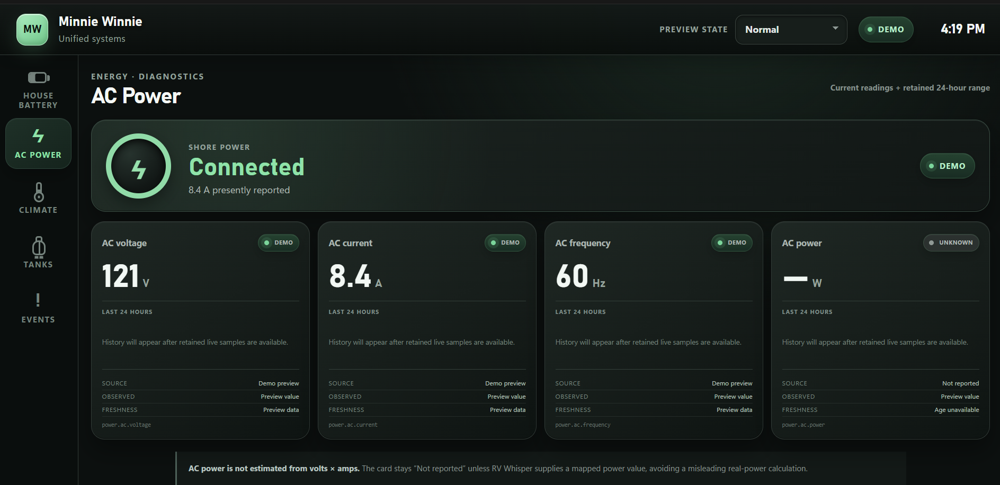
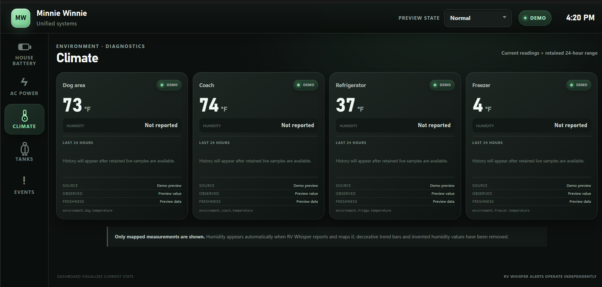
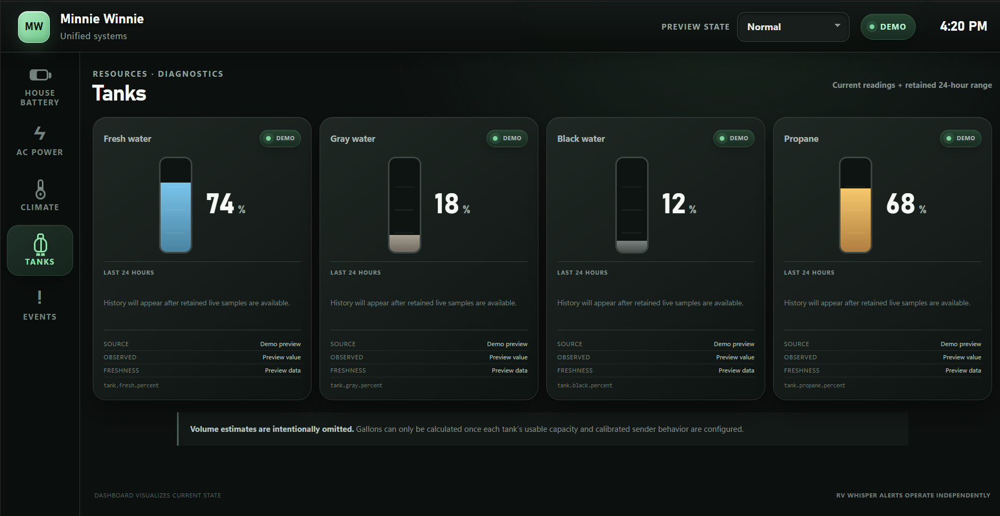
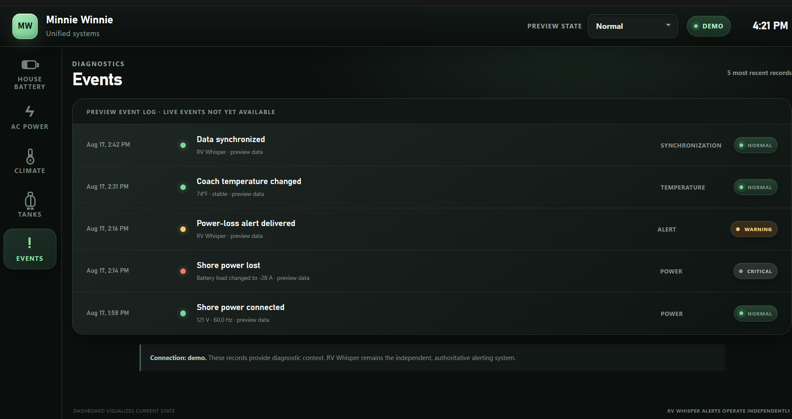

# Minnie Winnie Unified RV Dashboard

A clean, wall-mounted systems dashboard for a 2025 Winnebago Minnie Winnie 31K.

> **Normal = quiet. Problem = obvious. Detail = available when requested.**

The dashboard is a visualization and diagnostic interface. **RV Whisper remains the authoritative, independent monitoring, history, and alerting system.** A Pi failure must never prevent RV Whisper from notifying the owner.

## Interface gallery

The screenshots below show the representative demo dataset. Live mode uses mapped RV Whisper readings and clearly marks missing, stale, or unavailable data.

### Home



### Diagnostic views

| House Battery | AC Power |
| :---: | :---: |
|  |  |

| Climate | Tanks |
| :---: | :---: |
|  |  |

### Events



## What is implemented

- Responsive, kiosk-friendly Home, House Battery, AC Power, Climate, Tanks, and Events views
- Deliberate Normal, Shore Power Lost, and Stale Data preview states
- Diagnostic shore-loss summary showing battery load, dog temperature, and connectivity
- Conservative energy flow that never invents source attribution from net shunt current
- Normalized readings such as `power.battery.soc` and `environment.dog.temperature`
- RV Whisper collector supporting direct, credential-free RVM3 access on a trusted LAN and authenticated gateway fallback
- Read-only active-alert mirroring, including a conservative local sensor-page fallback when the consolidated alert page requires a device login
- Automatic session recovery, bounded polling, internal event bus, SSE browser updates, and SQLite history
- Demo mode that runs without RV hardware; live mode requires an observed sensor map and either a direct RVM3 address or gateway credentials

## Architecture

```text
BTH1 / Hughes / SeeLeveL ─► RV Whisper RVM3 ─► RV Whisper service
                                                        │ 30–60 sec
                                                        ▼
PowerMon direct BLE (phase 2) ───────────────► Local collector
                                                        │
                                             normalized state + SQLite
                                                        │ SSE
                                                        ▼
                                             touchscreen web dashboard
```

External acquisition may poll conservatively. Everything after collection is change-driven. The browser never polls individual sensors.

Direct LAN collection is preferred because it does not consume internet data and keeps the display working during an internet outage. Gateway access remains available as a fallback.

Alert evaluation and notification delivery remain entirely inside RV Whisper. The dashboard mirrors active conditions read-only. On local RVM3 firmware that protects the consolidated alert page, the collector reads the public per-sensor alert summaries instead. Those summaries expose alert titles but not acknowledgement metadata, so the dashboard conservatively labels them **Needs attention**. A changed or unavailable vendor page never clears previously observed alerts.

## Run the dashboard UI

Requires Node.js 22 or later.

```bash
npm ci
npm run dev
```

Open `http://localhost:3000`. Without the local API, the UI clearly labels itself **Demo** and uses representative data.

## Run the local API

Requires Python 3.11 or later.

```bash
cd backend
python -m venv .venv
source .venv/bin/activate
pip install -e .
cp .env.example .env
rv-dashboard
```

The API listens on `http://localhost:8080` by default. Set `NEXT_PUBLIC_DASHBOARD_API_URL` for a different host.

### Live RV Whisper mode

1. Operate in demo mode first.
2. Capture real JSON for each installed sensor.
3. Copy `backend/config/sensor-map.example.json` to `sensor-map.json` and map only observed fields.
4. Prefer `RVW_ACCESS_MODE=local` with `RVW_BASE_URL` set to the RVM3's direct LAN address. Gateway mode additionally requires `RVW_USERNAME` and `RVW_PASSWORD`.
5. Start with `RVW_POLL_SECONDS=60`; do not reduce it until RV Whisper confirms an acceptable cadence.
6. Trigger one noncritical test alert and confirm that it appears on Home and Events without changing or acknowledging it in the dashboard.

LAN addresses, credentials, and real sensor mappings belong in the Pi's protected environment file and must never be committed.

## Install on a Raspberry Pi

The repository includes a versioned installer, hardened service definitions, a kiosk helper, a verification command, and a protected live-payload capture tool. Start with the complete [Raspberry Pi installation and live-data checklist](docs/pi-installation.md).

```bash
sudo bash deploy/install-pi.sh
sudo /opt/minnie-dashboard/current/deploy/verify-pi.sh
```

The installer intentionally starts in demo mode and preserves Pi-only credentials and mappings across upgrades.

### Configure an installation

Each installation keeps its identity, RVM3 address, sensor mapping, and display choices outside the public repository. The interactive installer offers to collect the RV display name and direct RVM3 LAN address. It can also be rerun later:

```bash
sudo /opt/minnie-dashboard/current/deploy/configure-dashboard.sh
```

`dashboard-profile.json` controls the RV name, monogram, enabled sections, climate sensor labels/count, tank labels/count, and which items appear on Home. `sensor-map.json` independently maps the fields actually reported by that owner's RV Whisper installation to normalized dashboard paths. The home screen shows up to four selected climate readings and four selected tanks; detail pages show every configured item.

Wi-Fi names and passwords are managed by Raspberry Pi OS, not by the dashboard. The dashboard profile, RVM3 LAN address, credentials, and real sensor names remain Pi-local and are never committed.

## Safety and data freshness

- RV Whisper alerts remain enabled and independent.
- Every reading includes its observation time, source, and health.
- Values older than the configured freshness window become **STALE**.
- A collector or internet failure never silently presents old data as current.
- Source-specific data is mapped at the adapter boundary, not inside UI components.

## Project map

- `app/` — touchscreen interface
- `backend/rv_dashboard/` — collector, normalizer, SQLite store, event bus, and API
- `backend/config/` — sensor mapping populated only after payload capture
- `backend/tests/` — freshness, normalization, and storage tests
- `docs/architecture.md` — system decisions and failure boundaries
- `docs/privacy.md` — public-repository privacy rules
- `docs/pi-installation.md` — Pi install, kiosk, capture, mapping, and live-mode checklist
- `docs/open-questions/` — GitHub-ready issue drafts
- `deploy/` — Raspberry Pi service examples

## Public repository safety

Runtime databases, credentials, real sensor maps, payload captures, bytecode, and local environment files are excluded from Git. `npm run privacy:scan` checks source files for email addresses, home-directory paths, device IDs, and populated credential assignments. CI runs the same check before building the dashboard.

## Reference

Data-access behavior is derived from [Yeraze/rvwhisper-monitor](https://github.com/Yeraze/rvwhisper-monitor), used as a reference rather than a UI base. That project documents the current web-service flow: login CSRF fields, authenticated cookies, dashboard nonce and sensor discovery, and `get_latest_data_by_date` payload retrieval.

## Status

The software foundation and hardware-independent MVP are ready. Direct-LAN RVM3 telemetry and read-only active-alert mirroring have been validated against observed firmware behavior. Each installation still requires its own private sensor map and dashboard profile; unsupported or uninstalled battery, tank, and other hardware remains **Not reported** rather than being estimated. Alert acknowledgement is intentionally disabled pending authenticated, noncritical validation. See the open-question drafts before making additional hardware-specific assumptions.
